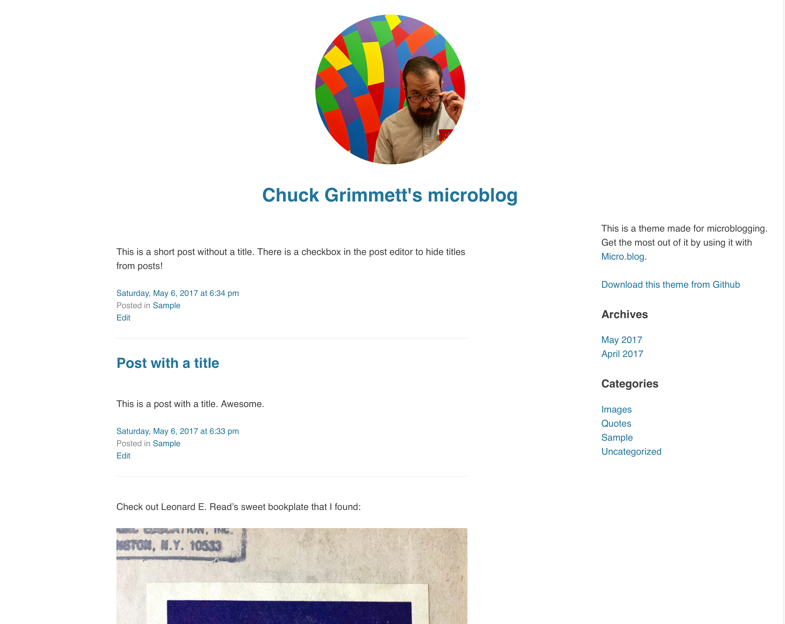

# simple-microblog

This is a minimalist microblogging WordPress theme. After learning about the [micro.blog](http://micro.blog) project, I decided that I wanted to host my own microblog and use the micro.blog service to cross-post to Twitter, Facebook, and micro.blog.

## Particulars

- Header image is the [gravatar](http://gravatar.com) pulled in from the administrator's email address. To change the header image, change the administrator's email address and/or change your main image at Gravatar.
- There is an option in the post editor to suppress the title for posts on the homepage and single pages
- There is no main menu at the top. If you want a menu to get to sub pages, [create a menu](https://codex.wordpress.org/WordPress_Menu_User_Guide), then add a custom menu widget to the sidebar widget area.
- The footer widget area is enabled. You can add any widget you like to the footer.  
- Comments are turned off globally
- This theme makes it easy to [verify your website with Micro.blog](http://help.micro.blog/2017/web-site-verification/). In the WordPress admin, go to Settings > Micro.blog Verification and put in your Micro.blog username. 
- Fontawesome is included via maxcdn because I like using icons.
- Requires at least: 4.0
- Tested up to: 4.7.4
- Stable tag: 1.0.0
- License: GNU General Public License v2

## Installation

1. In your admin panel, go to Appearance > Themes and click the Add New button.
2. Click Upload and Choose File, then select the theme's .zip file. Click Install Now.
3. Click Activate to use your new theme right away.

## Roadmap

- [x] Gravatar header pull-in from admin's email address
- [x] Make the theme mobile responsive
- [x] Turn title on and off for posts
- [x] Tagline output below header image
- [x] Include a settings page for micro.blog verification
- [x] Include footer widgets for adding extra info
- [x] Add basic sidebar
- [ ] Clean pagination
- [ ] Add emoji support

## Changelog

### 1.0 - May 7, 2017
* Initial release

## Credits

* Based on Underscores http://underscores.me/, (C) 2012-2016 Automattic, Inc., [GPLv2 or later](https://www.gnu.org/licenses/gpl-2.0.html)
* normalize.css http://necolas.github.io/normalize.css/, (C) 2012-2016 Nicolas Gallagher and Jonathan Neal, [MIT](http://opensource.org/licenses/MIT)
* Verification panel based on [https://codex.wordpress.org/Creating_Options_Pages](https://codex.wordpress.org/Creating_Options_Pages)
* Turning off titles based on Title Remover plugin by [http://www.brittanyinternetservices.com/](http://www.brittanyinternetservices.com/)